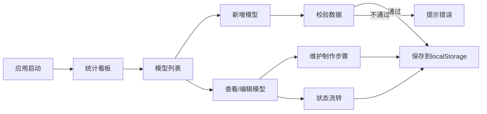

## 1. 产品概述

牙科诊所义齿模型流转看板，用于诊所内部管理义齿模型从取模到交付的全生命周期流程。解决传统纸质记录容易丢失、制作进度不透明、延期交付难以追踪等问题。

- 主要目标用户：牙科诊所的技师、医生、前台管理人员
- 核心价值：提升义齿制作流程透明度，减少延期交付，提高工作效率

## 2. 核心功能

### 2.1 用户角色
| 角色 | 注册方式 | 核心权限 |
|------|----------|----------|
| 诊所工作人员 | 无需注册，本地应用 | 完整功能：模型增删改查、制作步骤维护、状态流转、统计查看 |

### 2.2 功能模块
1. **统计看板页面**：数据概览卡、状态分布图表、交付趋势图表、延期预警列表
2. **模型列表页面**：模型卡片/表格展示、筛选搜索、快速状态操作
3. **模型新增/编辑页面**：模型信息表单、制作步骤管理、校验规则
4. **制作步骤管理**：步骤增删改、完成状态切换、备注记录

### 2.3 页面详情
| 页面名称 | 模块名称 | 功能描述 |
|-----------|-------------|---------------------|
| 统计看板 | 数据概览卡 | 显示模型总数、进行中、待交付、已交付、已取消数量 |
| 统计看板 | 状态分布图 | 饼图展示各状态模型占比 |
| 统计看板 | 交付趋势图 | 折线图展示近30天交付/新增趋势 |
| 统计看板 | 延期预警列表 | 醒目展示已延期或即将延期的模型 |
| 模型列表 | 搜索筛选栏 | 支持按编号、患者姓名搜索，按状态、义齿类型、负责人筛选 |
| 模型列表 | 模型卡片/表格 | 展示模型核心信息，延期模型红色醒目标识 |
| 模型列表 | 快捷操作 | 状态流转按钮、查看详情、编辑、删除 |
| 模型详情/编辑 | 基本信息表单 | 模型编号、患者姓名、义齿类型、取模/交付日期、负责人、状态 |
| 模型详情/编辑 | 制作步骤列表 | 步骤名称、负责人、计划完成日期、完成状态、备注 |
| 模型详情/编辑 | 步骤操作 | 新增、编辑、删除步骤，标记完成 |

## 3. 核心流程

用户打开应用后，首先看到统计看板，了解全局情况。然后可以进入模型列表查看所有模型，或直接新增模型。对于每个模型，可以维护其制作步骤，并按照状态流转规则推进。所有数据保存在浏览器 localStorage 中，刷新不丢失。

## 4. 用户界面设计

### 4.1 设计风格
- 主色调：专业医疗蓝（#2563eb），辅助色：健康绿（#10b981）、警示红（#ef4444）、提醒橙（#f59e0b）
- 按钮风格：圆角矩形，有悬停阴影效果
- 字体：中文使用系统无衬线字体，清晰易读
- 布局：顶部导航 + 侧边栏 + 主内容区，卡片式布局
- 图标：简洁的线性图标

### 4.2 页面设计概要
| 页面名称 | 模块名称 | UI元素 |
|-----------|-------------|-------------|
| 统计看板 | 概览卡片 | 彩色渐变背景，大数字，状态图标 |
| 统计看板 | 图表区域 | ApexCharts 饼图和折线图，响应式容器 |
| 统计看板 | 延期列表 | 红色边框警告样式，高亮延期天数 |
| 模型列表 | 搜索栏 | 输入框、下拉选择器、重置按钮 |
| 模型列表 | 卡片网格 | 悬停阴影效果，状态色边框标记 |
| 模型表单 | 表单控件 | Skeleton UI 输入框、日期选择器、下拉选择 |
| 模型表单 | 步骤列表 | 可折叠面板，完成状态勾选，备注文本域 |

### 4.3 响应式
桌面端优先设计，在平板和手机端自动调整为单列布局，侧边栏折叠为汉堡菜单。
