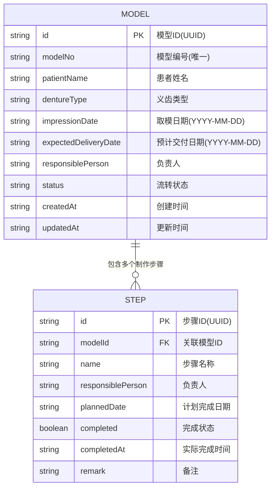

## 1. 架构设计

```mermaid
graph TD
    A["SvelteKit 前端应用"] --> B["页面层 (Routes/Pages)"]
    B --> B1["统计看板 /"]
    B --> B2["模型列表 /models"]
    B --> B3["模型新增 /models/new"]
    B --> B4["模型编辑 /models/[id]"]
    A --> C["组件层 (Components)"]
    C --> C1["ModelCard 模型卡片"]
    C --> C2["ModelForm 模型表单"]
    C --> C3["StepList 步骤列表"]
    C --> C4["StepForm 步骤表单"]
    C --> C5["SearchFilter 搜索筛选"]
    C --> C6["StatCard 统计卡片"]
    C --> C7["StatusBadge 状态标签"]
    A --> D["状态管理层 (Stores)"]
    D --> D1["models Store 模型数据"]
    A --> E["工具层 (Utils)"]
    E --> E1["storage.ts localStorage封装"]
    E --> E2["validators.ts 数据校验"]
    E --> E3["formatters.ts 格式化工具"]
    A --> F["数据持久层"]
    F --> F1["浏览器 localStorage"]
```



## 2. 技术描述

- **前端框架**：SvelteKit 2.x + TypeScript
- **UI 组件库**：Skeleton UI 3.x (基于 Tailwind CSS)
- **样式方案**：Tailwind CSS 3.x
- **图表库**：ApexCharts + svelte-apexcharts
- **数据存储**：浏览器 localStorage（纯前端，无后端）
- **构建工具**：Vite（SvelteKit 内置）
- **包管理器**：pnpm（优先）或 npm

## 3. 路由定义

| 路由 | 页面组件 | 用途 |
|-------|---------|------|
| / | src/routes/+page.svelte | 统计看板首页 |
| /models | src/routes/models/+page.svelte | 模型列表页 |
| /models/new | src/routes/models/new/+page.svelte | 新增模型页 |
| /models/[id] | src/routes/models/[id]/+page.svelte | 模型详情/编辑页 |

## 4. 数据模型

### 4.1 数据模型定义



### 4.2 枚举定义

- **流转状态 (FlowStatus)**：
  - `PENDING`：待制作
  - `IN_PROGRESS`：制作中
  - `TRIAL`：待试戴
  - `DELIVERED`：已交付
  - `CANCELLED`：已取消

- **义齿类型 (DentureType)**：
  - `FULL_DENTURE`：全口义齿
  - `PARTIAL_DENTURE`：局部义齿
  - `CROWN`：单冠
  - `BRIDGE`：固定桥
  - `IMPLANT`：种植修复
  - `ORTHODONTIC`：正畸矫治器

## 5. 数据校验规则

1. **模型编号**：非空 + 全局唯一
2. **患者姓名**：非空，最多 50 字符
3. **取模日期**：非空，且不能晚于当前日期
4. **预计交付日期**：非空，且不能早于取模日期
5. **状态流转到"已交付"**：必须所有制作步骤都已标记完成
6. **步骤名称**：非空
7. **步骤计划完成日期**：非空

## 6. localStorage 存储结构

```typescript
// localStorage key
const STORAGE_KEY = 'denture_models_v1';

// 存储数据结构
interface StorageData {
  models: Model[];
  steps: Step[];
  updatedAt: string;
}
```

应用启动时从 localStorage 读取，数据变更时自动持久化到 localStorage。
